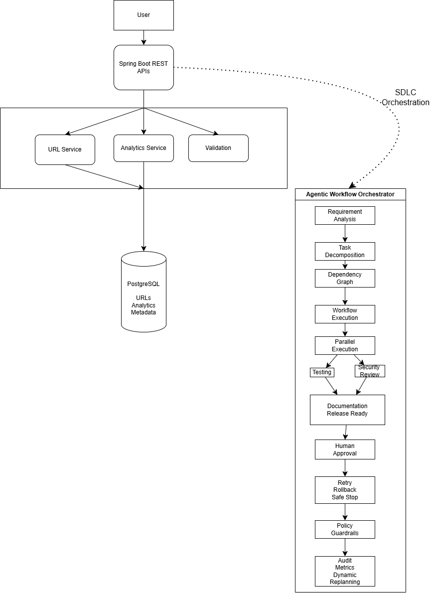

# Agentic URL Shortener System Architecture

## Overview

The Agentic URL Shortener is built using a layered architecture with an
agentic workflow orchestrator that manages the software engineering lifecycle.

The system consists of:

- User Interface
- Spring Boot REST APIs
- Application Services
- PostgreSQL Database
- Agentic Workflow Orchestrator

## Architecture Diagram

## Components

### User

The client interacts with the application using REST APIs to shorten URLs,
retrieve analytics, and redirect shortened URLs.

### Spring Boot REST APIs

Provides REST endpoints for:

- POST /shorten
- GET /{shortCode}
- GET /analytics/{shortCode}

### Application Services

The business layer contains:

- URL Service
- Analytics Service
- Validation Service

### PostgreSQL

Stores:

- Short URLs
- Analytics
- Metadata

### Agentic Workflow Orchestrator

The orchestration layer manages the engineering workflow:

- Requirement Analysis
- Task Decomposition
- Dependency Graph
- Workflow Execution
- Parallel Execution
- Human Approval
- Retry / Rollback / Safe Stop
- Policy Guardrails
- Audit & Metrics
- Dynamic Replanning

## Workflow

The orchestration engine coordinates the software development lifecycle.

1. Analyze requirements.
2. Decompose work into tasks.
3. Build a dependency graph.
4. Execute implementation.
5. Run Testing and Security Review in parallel.
6. Synchronize both activities.
7. Request Human Approval.
8. Apply policy validation.
9. Produce documentation and release-ready artifacts.

## Key Architectural Decisions

- Modular layered architecture
- Stateless REST APIs
- Separation of business logic
- Dependency-driven orchestration
- Parallel task execution
- Human approval for critical operations
- Audit trail and workflow metrics